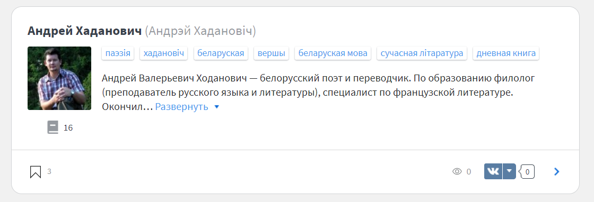

# Belorussian writers

We are going to look through all authors at https://www.livelib.ru/authors/belorussian and analyze their tags. For example, here:

we can see such tags as _poetry, belorussian language, modern literature_.

We'd like to find out which tags are the most common and find some correlations. Is it true that modern authors write more prose than poetry? Let's find out.

## Instruments

This is the study project for the Introduction to Data Analysis subject. It is written in Python with the help of BeautifulSoap, Pandas, Numpy.

## Jupyter Notebook

The project is written in the format of interactive presentation with the help of Jupyter Notebook.

To read the contents of the project and/or run it, you'll need [jupyter notebook](https://jupyter.org/) installed. You can also upload it [here](https://cocalc.com/doc/jupyter-notebook.html) to run online.